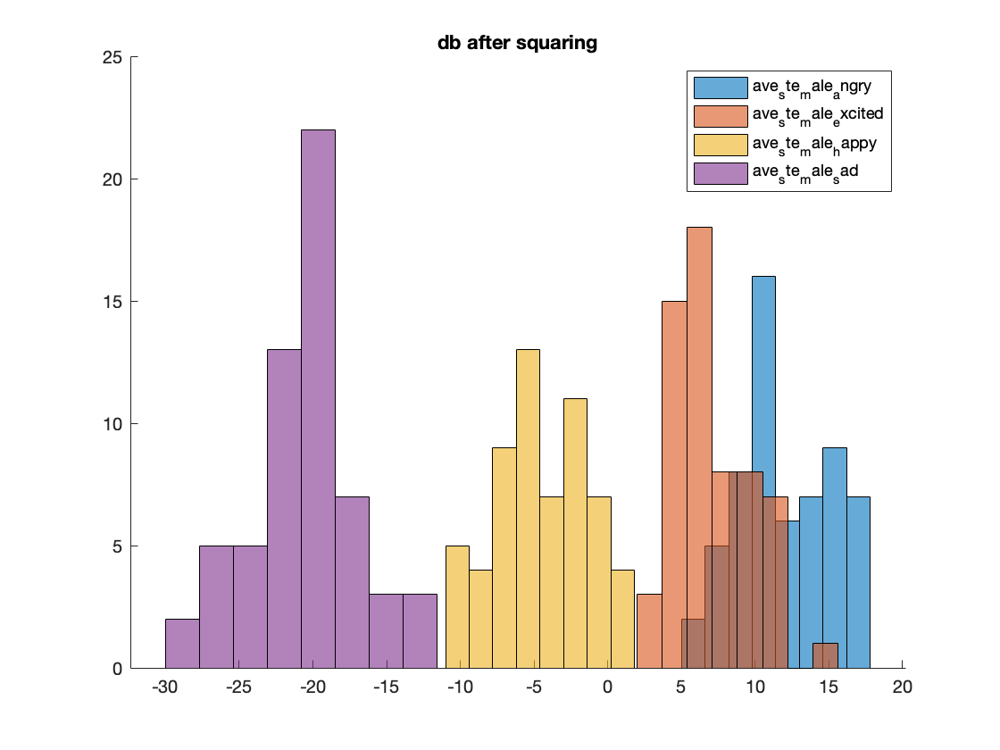

# Digital Signal Processing #

> ELECTENG 733  
> University of Auckland  
> Simon Shan

**Emotion recognition** - *Practical Implementation Assignment 2*  
May 2020

- [x] angry
- [x] excited
- [x] happy
- [x] sad

data preperation and feature extraction done for all 60 audio signals (together), but traning (i.e. the mle function) is only done on the first 48, classification is done on the last 12 (using the extracted features)

## Background ##

Human-Computer Interaction applications like healthcare robots, talking aids and devices that
interact with humans socially require robust emotion recognition systems. Using this emotion
recognition capability, Human-Computer Interactive technology can understand human emotions
and respond accordingly. Emotion recongition can be done from facial expressions, speech and
gestures. In this assignment, your task is to build an emotion recognition system with speech signal
as the input. With the power of signal processing, statistical analysis and machine learning, robust
emotion recognition systems have been developed by researchers. However, human emotions are
complex, and the features of the speech signal vary depending on the age, gender, accent-type and
language of the speaker. Hence, the task becomes complicated. Good knowledge about the speech
signal, signal processing techniques and decision making are key stages that can help to produce
better speech recognisers. In this assignment, you will go through the process of developing an
emotion recogniser from speech signal, implementing majority of the concepts you learnt during
Part 1 of ELECTENG 733. It will consist of a Training stage and a Testing stage.

[assignment brief](background/ELECTENG733_PIA2_questions.docx)  
https://www.isca-speech.org/archive/Interspeech_2018/pdfs/1349.pdf

### Requirements ###

MATLAB [(download)](https://www.mathworks.com/downloads/)

run `main.m`

### Explaination ###

#### Speech Features ####

- [x] `short_time_energy.m`
- [x] `zero_crossing_rate.m`
- [ ] `pitch.m`
- [ ] `spectral_energy.m`

## Authors ##

- **simon** - *~~buy my merch~~ hire me pls* - [mightbesimon](https://github.com/mightbesimon)
@mightbesimon

## License ##

MIT

## Acknowledgments ##

- **these are just my sample codes, if you misuse them its not my problem**
- not actually in ELECTENG 733, just felt like doing the project for fun